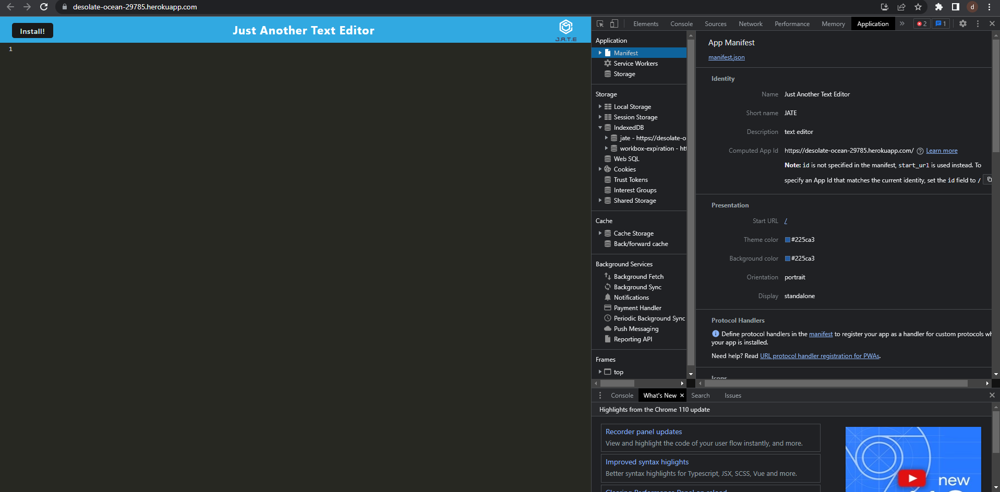
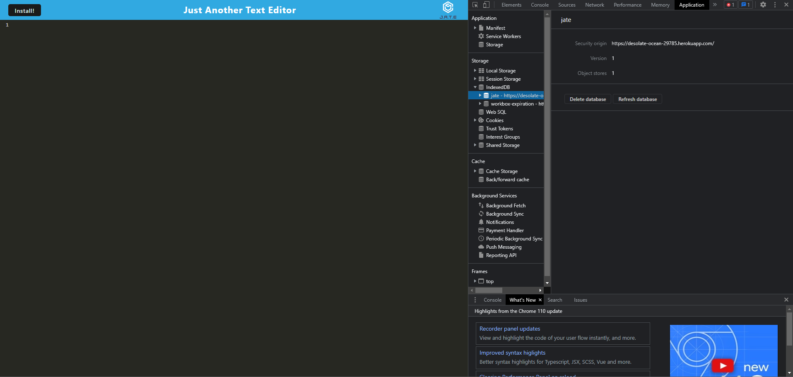
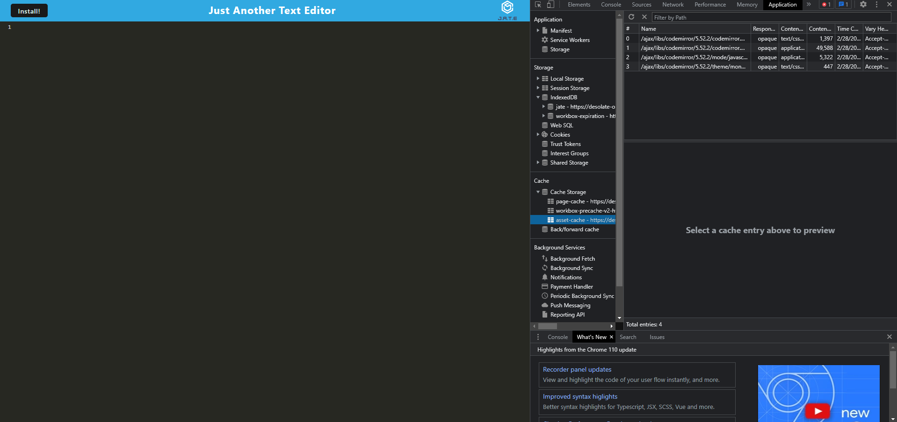

# text-editor-pwa

## User Story 
```
AS A developer
I WANT to create notes or code snippets with or without an internet connection
SO THAT I can reliably retrieve them for later use
```

## Table of Contents

1. [Description](#description)
2. [Technology](#Technology)
3. [Deployed Link](#Deployed-Link)
4. [Screenshots](#screenshots)
5. [Contact Info](#contact-info)

## Description:

Text editor that runs in the browser. The is a single-page application that meets the PWA criteria. Additionally, it features a number of data persistence techniques that serve as redundancy in case one of the options is not supported by the browser. The application also functions offline.

## Technology:

- Node.js
- Express.js
- IndexedDB
- webpack

## Deployed Link: 

-[Heroku](https://desolate-ocean-29785.herokuapp.com)

## Screenshots:

### Here is shown the manifest file.

### Here is shown the service worker.

### Here is shown the indexDB storage.

### Here is shown the apps cache strategies 


## Contact Info:

Please feel free to contact me if you need any further information:

- [Email](mailto:devinelliotgomez@gmail.com)
- [Github](https://github.com/devgomez1)